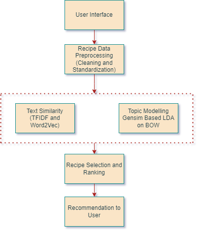

# NLP Based Recipe Recommendation System :yum: 

It is time to cook lunch and you open your refrigerator just to find that you have celery, broccoli, eggs, and oranges. What to cook out of it? I would say it takes me a few Google searches and reading a few blogs to find a recipe that involves these ingredients to cook.

I usually get frustrated by the last-minute hassle of finding out a relevant recipe to try. I believe the hostel dwellers, working and busy moms, and casual cooks need something quick and easy to cater to them with the most relevant recipe.

Motivated by this need, I decided to build a **recommender system to suggest recipes based on user input.**

**Recommender Systems** are employed everywhere in most of the apps that we use. It automatically suggests the relevant options, topics, music, food, and movies to help us make better choices. When it comes to implementing NLP in recommender, it utilizes the similarity of the content. In this project we are using NLP content-based filtering to suggest users with top recipes relevant to what data they enter - be it recipe name, or ingredient list.  

In our project we only have text data of recipes, we don't have metadata like cuisine type, difficulty level, cook-time, seasonal data, or user-generated content (e.g., comments, votes, and reviews).

## Project Plan

In this project, I am trying to recommend the top five recipes based on user input text data.
Approach to solve this problem :
1. I am utilizing data scrapped by Ryan Lee and presently available publically on the website [RecipeBox](https://eightportions.com/datasets/Recipes/) which contains 125,000 scraped recipes from three websites (Foodnetwork.com, Epicurious.com, and Allrecipes.com).
2. First, my approach is to preprocess the data in context to -
  - Handling null values and duplicates.
  - Deleting unnecessary rows where the information may be incorrect.
  - Adding all text together and standardizing it for natural language processing.
        - Remove stop words, punctuations, and numbers.
        - Change to lowercase and do lemmatization on the text data.
3. Doing some exploratory data analysis like most common ingredients etc.
4. After cleaning the text and preprocessing it, I am employing the below approaches to recommend recipes based on user input.
  - First, Using TF-IDF vectorization to vectorize recipes and user input. Employing cosine similarity to recommend the top five recipes.
  - Second, Using word2Vec embeddings and finding cosine similarity on user input and recipes.
  - Third, using Gensim-based LDA on the BOW model and cosine similarity.
5. Visually inspecting the result since, I don't have labeled data and determining which model is giving me the best result. I will try to fine tune the model that gives me the highest average cosine score.

Below is the high-level diagram of the steps involved in the project.

Through this project I was trying to learn NLP better and utilized it practically by implementing the concepts in recommending recipes. I am sure more can be done to improve this and if there are any queries, improvements and comments please feel free to let me know.

**References**
- [https://eightportions.com/datasets/Recipes/](https://eightportions.com/datasets/Recipes/)
- [https://towardsdatascience.com/building-a-recipe-recommendation-api-using-scikit-learn-nltk-docker-flask-and-heroku-bfc6c4bdd2d4](https://towardsdatascience.com/building-a-recipe-recommendation-api-using-scikit-learn-nltk-docker-flask-and-heroku-bfc6c4bdd2d4)
- [https://github.com/JohnVillanueva/Recipe-Recommendation-System](https://github.com/JohnVillanueva/Recipe-Recommendation-System)
- [https://medium.com/@hajar.zankadi/using-latent-dirichlet-allocation-lda-and-nlp-techniques-to-predict-interest-tags-from-tweets-d0e275b1032d](https://medium.com/@hajar.zankadi/using-latent-dirichlet-allocation-lda-and-nlp-techniques-to-predict-interest-tags-from-tweets-d0e275b1032d)
